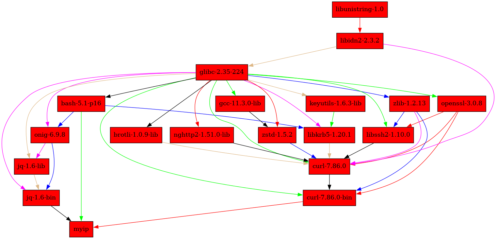
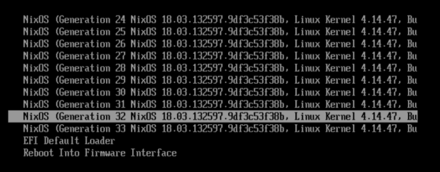

# Überblick

- **Nix** ist ein **Paketmanager und Buildsystem**
  - Geschichte: Eelco Dolstra started Nix as a research project in 2003
  PhD Thesis [The Purely Functional Software Deployment Model](https://edolstra.github.io/pubs/phd-thesis.pdf)
  - Features:
      - Atomare Upgrades und Rollbacks
      - mehrere Versionen einer Software gleichzeitig installierbar
      - **Reproducable builds** (und **reproducable installations**) dank exaktem Pinning der Dependencies und Sandboxed Builds
      - Quellbasiert, aber Artefakte werden zentral gecached
- Nix ist eine Programmiersprache
  - Funktionale DSL für "Bauanleitungen für Software"
- [nixpkgs](https://github.com/NixOS/nixpkgs) definiert Pakete für Nix
  - größtes existierende Sammlung an Paketen (laut [repology](https://repology.org/))
  - sehr viele Contributors
  - relativ aktuelle Pakete
- **NixOS** nutzt Nix um das ganze Betriebssystem deklarativ und reproduzierbar aufzusetzen

# Wie funktionieren atomare Upgrades und Rollbacks?

- Pakete haben keine Pre- und Post-Install Skripte. Das ist auch für Reproducible Installations wichtig.
- Pakete werden nicht nach /usr kopiert, sondern in isolierte Verzeichnisse im "Nix Store" (`/nix/store`)
  - Pakete sind immutable

```
~: ls -l /nix/store/ | head
total 13G
-r--r--r--     2 root    root   4,2K  1. Jan 1970  00012jg15gp88xdkd09xi4k7nzw5jb9g-python3.10-pep517-0.12.0.drv
-r--r--r--     2 root    root   3,0K  1. Jan 1970  0001x7jz6zwhvfgadhrc4z6i39jmx1wb-unit-accounts-daemon.service.drv
-r--r--r--     2 root    root   2,9K  1. Jan 1970  0003n8jvayi4gr4281s42s2zmq5fgrgb-zope.location-4.2.tar.gz.drv
dr-xr-xr-x     4 root    root   4,0K  1. Jan 1970  0008l9p6inwr416r70px34xjh46zj4qx-aws-c-http-0.6.10
-r--r--r--     2 root    root   1,8K  1. Jan 1970  0009r9fh8s0j5c25vy2ihalc5yzgh4dn-cargo-check-hook.sh.drv
-r--r--r--     2 root    root   4,2K  1. Jan 1970  000clnxd40qy0gyrlg9564l2ga0k26dg-gotags-20150803-be986a3.drv
dr-xr-xr-x     4 root    root   4,0K  1. Jan 1970  000dvmibiid0vbmay4mdnd8iasqycbk1-libmicrodns-0.2.0
```

- Nachteil: Häufig Sonderbehandlung nötig. Viele Programme suchen nach Abhängigkeiten in `/usr`
- Binaries werden so gepatcht, daß sie ihre libraries nicht in `/usr/lib` suchen, sondern
  an den exakt spezifizierten Pfaden
- Damit man in seiner Umgebung bestimmte Programme "sieht", wird die PATH Variable angepasst.


# Wie funktionieren Reproducible Builds?

- exaktes Pinning der Dependencies: 
```
$ cat my-ip.nix
{ pkgs ? import <nixpkgs> {} }:

pkgs.writeShellScriptBin "myip" ''
export PATH=${pkgs.lib.makeBinPath [ pkgs.curl pkgs.jq ]}

curl "https://httpbin.org/ip" | jq ".origin"
''

$ nix-build my-ip.nix

nix-build my-ip.nix
this derivation will be built:
  /nix/store/7wja9afxc5yzx02c67y93rg323rp7wjm-myip.drv
building '/nix/store/7wja9afxc5yzx02c67y93rg323rp7wjm-myip.drv'...
/nix/store/bf04ly63z7lxd88mmsgmdd2qr89irjxj-myip

$ tree /nix/store/bf04ly63z7lxd88mmsgmdd2qr89irjxj-myip/
/nix/store/bf04ly63z7lxd88mmsgmdd2qr89irjxj-myip/
└── bin
    └── myip

$ cat /nix/store/bf04ly63z7lxd88mmsgmdd2qr89irjxj-myip/bin/myip
#!/nix/store/kga2r02rmyxl14sg96nxbdhifq3rb8lc-bash-5.1-p16/bin/bash
export PATH=/nix/store/5wx14rp7g8lqc1r6jkkf1v8n8119l2mq-curl-7.86.0-bin/bin:/nix/store/5cnq0rszbf91vap4ii260rzidaidp83z-jq-1.6-bin/bin

curl "https://httpbin.org/ip" | jq ".origin"


$ /nix/store/bf04ly63z7lxd88mmsgmdd2qr89irjxj-myip/bin/myip
  % Total    % Received % Xferd  Average Speed   Time    Time     Time  Current
                                 Dload  Upload   Total   Spent    Left  Speed
100    31    0    31    0     0      0      0 --:--:--  0:00:39 --:--:--     8
"95.91.240.54"

```

# Die komischen Pfade

```
$ nix-store --query --graph /nix/store/bf04ly63z7lxd88mmsgmdd2qr89irjxj-myip/bin/myip > myip-dependencies.dot
$ dot -Tpng myip-dependencies.dot > myip-dependencies.png
```

- Die **Hashes im Store Path** sind nicht content-addressed, sondern **input-addressed**
  - wenn sich der Hash einer Abhängigkeit ändert, ändert sich auch der eigene Hash
  - die Hashes steht schon fest bevor das Paket gebaut wird
  - die Store Paths koennen als Identifier eine exakte Software Version benutzt werden


# nix-shell

```
$ cat shell.nix
{ pkgs ? import <nixpkgs> {} }:

let myip = (import ./my-ip.nix) { inherit pkgs; };

in

pkgs.mkShell {
  packages = [
    pkgs.pandoc
    pkgs.texlive.combined.scheme-full
    myip
    pkgs.python310.withPackages (p: [ p.requests p.numpy ])
    pkgs.nodejs-18_x
  ];
}
```

nix-shell starten:

```
$ nix-shell
[nix-shell]$ which myip
/nix/store/bf04ly63z7lxd88mmsgmdd2qr89irjxj-myip/bin/myip

[nix-shell]$ which pandoc
/nix/store/25xx4fxv2n7kvklc6sl0jn48mr796c3j-pandoc-2.17.1.1/bin/pandoc
```

Shell verlassen mit ctrl+d

```
$ which myip
myip not found

$ which pandoc
pandoc not found
```


# Ein echtes Beispielpaket: bazel-remote
[Link to source](https://github.com/NixOS/nixpkgs/blob/master/pkgs/development/tools/build-managers/bazel/bazel-remote/default.nix)
```
{ buildGoModule
, fetchFromGitHub
, lib
}:

buildGoModule rec {
  pname = "bazel-remote";
  version = "2.4.0";

  src = fetchFromGitHub {
    owner = "buchgr";
    repo = pname;
    rev = "v${version}";
    sha256 = "sha256-aC1I+33jEmgjtidA5CQXpwePsavwlx97abpsc68RkBI=";
  };

  vendorHash = "sha256-4vNRtFqtzoDHjDQwPe1/sJNzcCU+b7XHgQ5YqEzNhjI=";

  doCheck = false;

  meta = with lib; {
    homepage = "https://github.com/buchgr/bazel-remote";
    description = "A remote HTTP/1.1 cache for Bazel";
    license = licenses.asl20;
    maintainers = lib.teams.bazel.members;
    platforms = platforms.darwin ++ platforms.linux;
  };
}
```

# nixpkgs

- Wenn Ihr irgendwo  auf `import <nixpkgs>` stößt, wird <nixpkgs> auf einen lokalen Checkout von https://github.com/NixOS/nixpkgs aufgelöst.
  - Anders als z.B. `apt` arbeitet der nix Paketmanager direkt mit dem Quellcode der Paketdefinitionen
- nixpkgs enthält nicht nur sehr viele Paketdefinitionen, sondern auch sehr viele nützliche Hilfsfunktionen
  - z.B. Python Pakete, Go Pakete, Docker Images, VM Images, VIM Plugins, Nixos VM tests, etc


# NixOS

- Verwendet Nix um nicht nur Pakete, sondern ganze Systemkonfigurationen zu bauen
  - damit bekommen wir Nix's Features für das ganze System:
    - Reproducible builds
    - Atomare Upgrades und Rollbacks

```
$ readlink /run/current-system
/nix/store/z8l66l5sw5lg5vack0w27rg5b654jfii-nixos-system-petrosilia-22.11.4484.d83945caa76
```




Beispiel Config Ausschnitt:
```
{
  environment.systemPackages = [
    pkgs.meld
    pkgs.jetbrains.idea-ultimate
    pkgs.pulseaudio  # this gives me pactl but doesn't run pulseaudio
    pkgs.lxqt.lxqt-archiver
    pkgs.pantheon.evince
    pkgs.bazel-remote
    pkgs.rustup
    pkgs.bazel_5
    pkgs.aptly
    nixpkgs2305.teams
    pkgs.bluetuith
  ];

  # Minimal configuration for NFS support with Vagrant. (from NixOS Wiki)
  services.nfs.server.enable = true;
  networking.firewall.extraCommands = ''
    ip46tables -I INPUT 1 -i vboxnet+ -p tcp -m tcp --dport 2049 -j ACCEPT
  '';
  networking.firewall.allowedTCPPorts = [ 5678 ];

  virtualisation.lxd.enable = true;

  virtualisation.virtualbox.host.enable = true;  # Note that I had to reboot before I could actually use Virtualbox. Or maybe     virtualisation.virtualbox.host.addNetworkInterface would have helped?
  users.extraGroups.vboxusers.members = [ "jan" "heidbrij" ];
  environment.etc."vbox/networks.conf".text = ''
    * 3001::/64
    * 192.168.0.0/16
  '';
}
```

# Wie kann ich Nix einsetzen?

- als Paketmanager: `nix-env`
- Umgebungen mit `nix-shell` basteln
- Comma installiert Programme on the fly und fuehrt sie aus: https://github.com/nix-community/comma 
- Manage User Environments with Nix: https://github.com/nix-community/home-manager
- auf NixOS wechseln

# Ressourcen

- Eine gute Einführung in die Sprache: [Nix Pills](https://nixos.org/guides/nix-pills/)
- Forum: https://discourse.nixos.org/
- `#nixos` Channel im TNG Slack
